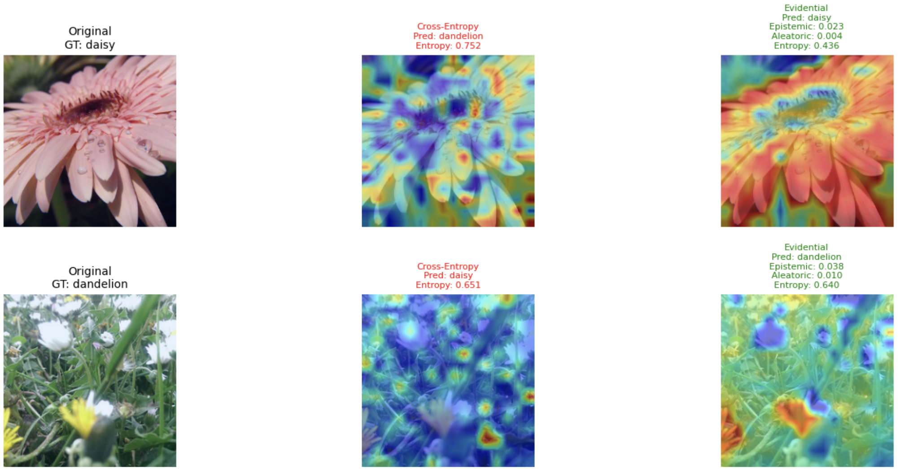
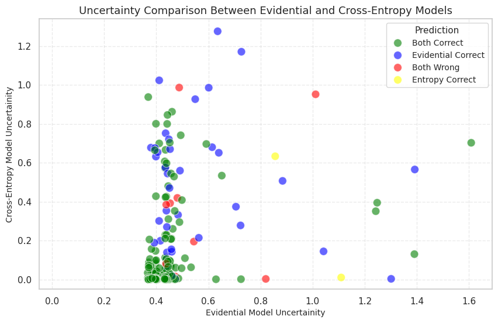

# 🔍 **Uncertainty Estimation in Deep Learning using Evidence theory**

This project explores uncertainty estimation in deep learning models using **Evidential Deep Learning** inspired by evidence theory and compares it with traditional **Cross-Entropy Loss**. The focus is on evaluating uncertainties such as **Epistemic**, **Aleatoric**, and **Total** uncertainty from the Evidential model and **Entropy-based uncertainty** from the Cross-Entropy model.

## 📂 **Project Features**

- **Dataset**: Flowers dataset from [Kaggle](https://www.kaggle.com/datasets/rahmasleam/flowers-dataset).
- **Models**: 
  - Pretrained DINO-v2-S/14 finetuned using Evidence-based loss.
  - Pretrained DINO-v2-S/14 finetuned using Cross-entropy loss.
- **Uncertainty Visualization**:
  - Grad-CAM visualizations for predictions.
  - Scatter plots comparing uncertainties between models.
- **Uncertainty Analysis**:
  - Mean uncertainty comparison for correct and incorrect predictions.
  - Scatter plot showing relationships between uncertainty types.
- **Interactive Plots**: Highlight differences between models for correct and incorrect predictions.

---

## 📊 **Sample Results**

### **Grad-CAM Heatmaps**

---

### **Scatter Plot: Comparison of Uncertainties**
This scatter plot compares **Evidential Total Uncertainty** (X-axis) with **Cross-Entropy Entropy** (Y-axis). Points are color-coded based on prediction correctness:

---

## 📊 **Accuracy, Precision, Recall, and F1 Score**

This table compares the performance metrics of the two models on the test dataset:

| **Metric**      | **Cross-Entropy Model** | **Evidential Model** |
|------------------|----------------------|--------------------------|
| **Accuracy**     | 94.55%               | 98.69%                   |
| **Precision**    | 86.32%               | 96.55%                   |
| **Recall**       | 86.07%               | 96.61%                   |
| **F1 Score**     | 86.14%               | 96.55%                   |

---

### **Mean Uncertainty Comparison**
| **Model**         | **Mean Uncertainty (Correct)** | **Mean Uncertainty (Wrong)** |
|--------------------|-------------------------------|-----------------------------|
| **Evidential**     | 0.445                         | 0.630                       |
| **Cross-Entropy**  | 0.070                         | 0.429                       |

---
## 🧠 **Findings**

One issue with regular Cross-Entropy models is that they maximize the model's confidence in predictions, which can result in overconfidence even when the model encounters **out-of-distribution (OOD) samples**. This means that traditional models lack the ability to express uncertainty, leading to unreliable predictions in unfamiliar scenarios.

### **Evidential Deep Learning**
Evidential deep learning addresses this limitation by leveraging **evidence theory** to make predictions. Instead of directly outputting probabilities, the model parameterizes a **Dirichlet distribution** over class probabilities, which allows it to express a degree of belief (or uncertainty) for each class. This framework:
- Separates **epistemic uncertainty** (uncertainty about the model itself) from **aleatoric uncertainty** (uncertainty inherent in the data).
- Provides a more meaningful representation of the model's perception of uncertainty.

### **Key Observations**
- **Feature Attention**: The Evidential model, as observed through Grad-CAM visualizations, focuses on more meaningful features to make predictions.
- **Superior Performance**: The Evidential model consistently outperforms the Cross-Entropy model, especially when evaluated on metrics like uncertainty awareness.
- **Uncertainty in Wrong Predictions**: For incorrect predictions, the Evidential model provides a perception of uncertainty that aligns with the ambiguity in the data, unlike the overconfident predictions of the Cross-Entropy model.
